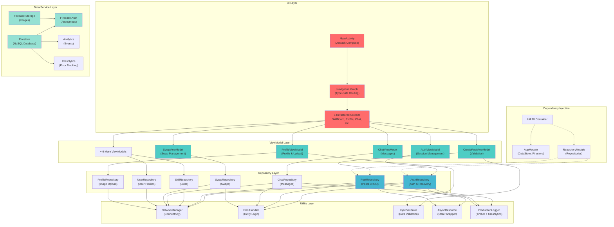
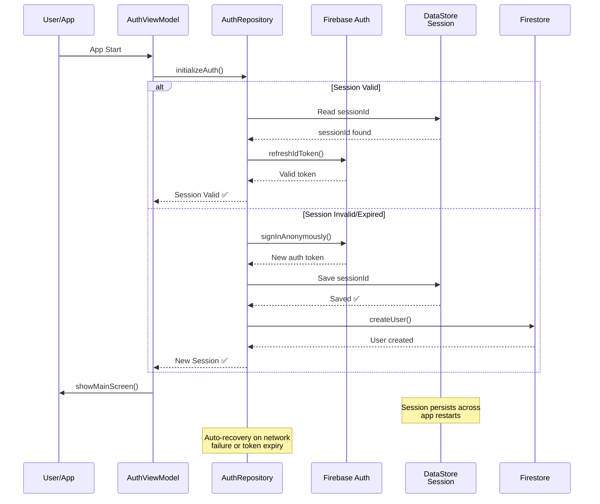
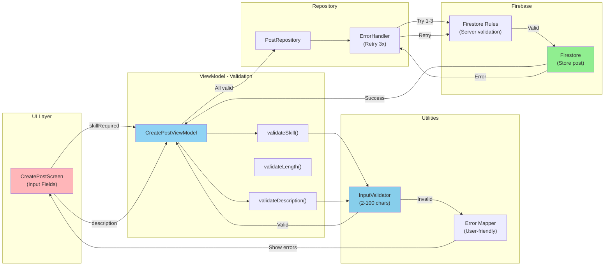
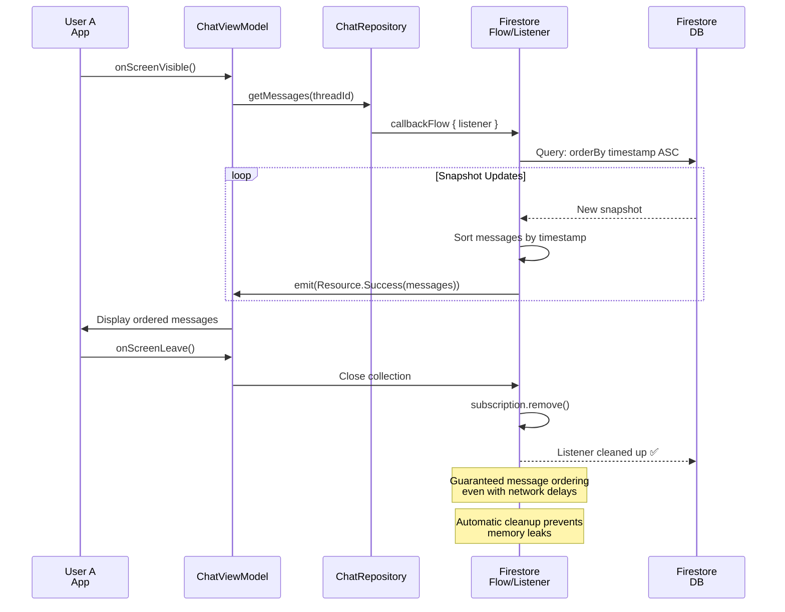
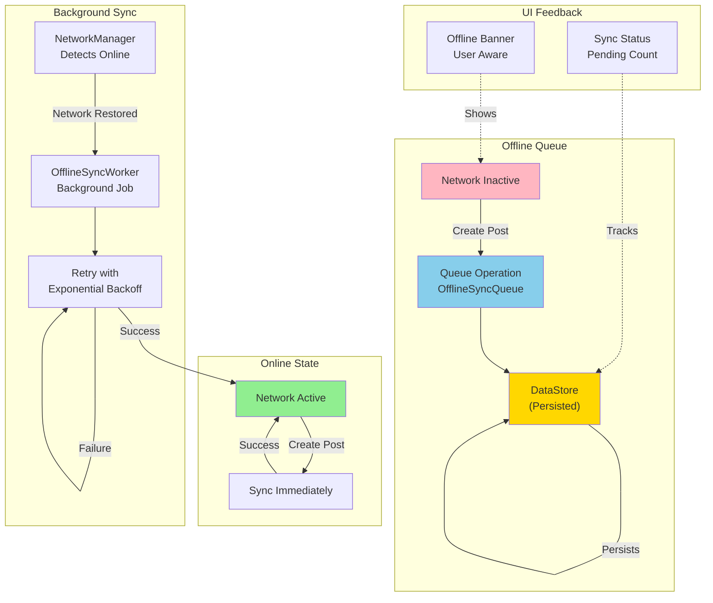
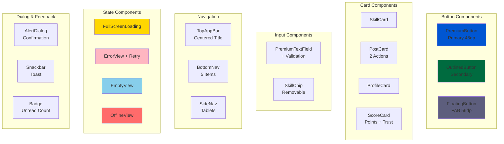

# SkillExchange Architecture Diagrams

**Document Version:** 1.0  
**Date:** 2025-01-15  
**Target:** Visual understanding of app architecture, data flow, and system interactions

---

## 1. Overall Application Architecture



---

## 2. User Authentication & Session Flow



---

## 3. Skill Post Creation & Validation Flow



---

## 4. Skill Swap Transaction Flow (Atomic)

```mermaid
graph TD
    subgraph "Initiate Swap"
        SwapVM["SwapViewModel<br/>initiateSwap()"]
        CheckPending["Check if action<br/>already pending"]
        ValidateHours["Validate hours<br/>1-168"]
    end

    subgraph "Create Swap"
        SwapRepo["SwapRepository<br/>createSwap()"]
        CreatePost["POST /swaps"]
    end

    subgraph "Accept Swap"
        AcceptVM["SwapViewModel<br/>acceptSwap()"]
        UpdateStatus["Update status<br/>to accepted"]
    end

    subgraph "Confirm & Progress"
        ConfirmVM["SwapViewModel<br/>confirmCompletion()"]
        Transaction["Firestore<br/>Transaction"]
        IdempotentCheck["Check if<br/>already confirmed"]
        UpdateUsers["Update both users<br/>(+10 trust)"]
        UpdateSkills["Deduct skill points"]
        UpdateSwapStatus["Update swap<br/>to completed"]
    end

    SwapVM --> CheckPending
    CheckPending -->|Pending| SwapVM
    CheckPending -->|Not pending| ValidateHours
    ValidateHours -->|Valid| SwapRepo
    SwapRepo --> CreatePost

    CreatePost -->|Success| AcceptVM
    AcceptVM --> UpdateStatus

    UpdateStatus -->|Success| ConfirmVM
    ConfirmVM --> Transaction
    Transaction --> IdempotentCheck

    IdempotentCheck -->|Already confirmed| Transaction
    IdempotentCheck -->|Not confirmed| UpdateUsers
    UpdateUsers --> UpdateSkills
    UpdateSkills --> UpdateSwapStatus
    UpdateSwapStatus -->|Commit| Transaction

    Transaction -->|Atomic: All or None| ConfirmVM

    style Transaction fill:#FFD700
    style IdempotentCheck fill:#87CEEB
    style UpdateUsers fill:#90EE90
    Note over Transaction: All updates succeed<br/>or all fail - zero partial updates
```

---

## 5. Real-Time Message Ordering



---

## 6. Offline-First Support Architecture



---

## 7. Error Handling & Retry Strategy

```mermaid
graph TB
    subgraph "Operation"
        Op["Repository Function<br/>Suspend"]
    end

    subgraph "ErrorHandler.withRetry"
        Try["Attempt 1"]
        isNetworkError["Is Network<br/>Error?"]
        isRetryable["Is Retryable?"]
    end

    subgraph "Retry Loop"
        Wait1["Wait 1s"]
        Try2["Attempt 2"]
        Wait2["Wait 2s"]
        Try3["Attempt 3"]
        Wait3["Wait 4s"]
        Try4["Attempt 4"]
    end

    subgraph "Fallback"
        LogError["Log to<br/>Crashlytics"]
        ReturnError["Return<br/>Result.failure()"]
    end

    Op --> Try
    Try -->|Exception| isNetworkError
    isNetworkError -->|No| LogError
    isNetworkError -->|Yes| isRetryable
    isRetryable -->|No| LogError
    isRetryable -->|Yes| Wait1
    
    Wait1 --> Try2
    Try2 -->|Success| Op
    Try2 -->|Failure| Wait2
    Wait2 --> Try3
    Try3 -->|Success| Op
    Try3 -->|Failure| Wait3
    Wait3 --> Try4
    Try4 -->|Success| Op
    Try4 -->|Failure| LogError

    LogError --> ReturnError
    ReturnError -->|To ViewModel| Op

    style Try fill:#87CEEB
    style Try2 fill:#87CEEB
    style Try3 fill:#87CEEB
    style Try4 fill:#87CEEB
    style Wait1 fill:#FFD700
    style Wait2 fill:#FFD700
    style LogError fill:#FFB6C1

    Note over Try,Try4: Max 3 retries<br/>Exponential backoff 1-10s
```

---

## 8. Data State Management (Resource Wrapper)

```mermaid
graph LR
    subgraph "States"
        Idle["Idle<br/>Initial State"]
        Loading["Loading<br/>Fetching Data"]
        Success["Success(data)<br/>Data Available"]
        Error["Error(message)<br/>Operation Failed"]
    end

    subgraph "Transitions"
        T1["User Action"]
        T2["Data Received"]
        T3["Exception"]
        T4["Retry Action"]
    end

    subgraph "UI Response"
        UI1["Show Nothing"]
        UI2["Show Spinner"]
        UI3["Show Content"]
        UI4["Show Error + Retry"]
    end

    Idle -->|T1| Loading
    Loading -->|T2| Success
    Loading -->|T3| Error
    Error -->|T4| Loading

    Idle --> UI1
    Loading --> UI2
    Success --> UI3
    Error --> UI4

    style Idle fill:#E0E0E0
    style Loading fill:#FFD700
    style Success fill:#90EE90
    style Error fill:#FFB6C1

    Note over Success,Error: Extension functions:<br/>isSuccess(), isError(), map(), etc.
```

---

## 9. Material 3 Component Hierarchy



---

## 10. Firebase Integration Layers

```mermaid
graph TB
    subgraph "App Layer"
        Repositories["Repositories<br/>(8 Total)"]
    end

    subgraph "Firebase SDK"
        Firebase["Firebase Core"]
    end

    subgraph "Authentication"
        Auth["Firebase Auth<br/>Anonymous SignIn"]
        AuthRules["Authentication Rules<br/>isSignedIn()"]
    end

    subgraph "Database"
        Firestore["Firestore NoSQL"]
        Collections["6 Collections<br/>with Security Rules"]
        Indexes["7 Composite<br/>Performance Indexes"]
    end

    subgraph "Storage"
        Storage["Cloud Storage"]
        StorageRules["Storage Rules<br/>5MB Limit, image/*"]
    end

    subgraph "Analytics & Monitoring"
        Crashlytics["Crashlytics<br/>Crash Reporting"]
        Analytics["Analytics<br/>Event Tracking"]
        Performance["Performance<br/>Monitoring"]
    end

    Repositories --> Firebase
    Firebase --> Auth
    Firebase --> Firestore
    Firebase --> Storage
    Firebase --> Crashlytics
    Firebase --> Analytics

    Auth --> AuthRules
    Firestore --> Collections
    Firestore --> Indexes
    Storage --> StorageRules

    style Auth fill:#4ECDC4
    style Firestore fill:#45B7D1
    style Storage fill:#95E1D3
    style Crashlytics fill:#FF6B6B
    style Analytics fill:#FFD700
```

---

## 11. Testing Architecture

```mermaid
graph TB
    subgraph "Unit Tests"
        UtilTests["UtilityTests<br/>40+ cases"]
        InputValidator["✓ Input validation"]
        ErrorHandler["✓ Retry logic"]
        ResourceExt["✓ Resource extensions"]
    end

    subgraph "ViewModel Tests"
        VMTests["ViewModelTests<br/>30+ cases"]
        AuthVM["✓ AuthViewModel"]
        CreatePostVM["✓ CreatePostViewModel"]
        ProfileVM["✓ ProfileViewModel"]
        SwapVM["✓ SwapViewModel"]
    end

    subgraph "Repository Tests"
        RepoTests["RepositoryTests<br/>40+ cases"]
        MockFirestore["Mock Firestore<br/>for unit testing"]
        AuthRepo["✓ AuthRepository"]
        PostRepo["✓ PostRepository"]
    end

    subgraph "UI Tests"
        UITests["Compose UI Tests<br/>40+ cases"]
        ButtonTests["✓ Button components"]
        CardTests["✓ Card components"]
        StateTests["✓ State components"]
    end

    subgraph "Integration"
        Integration["Integration Tests"]
        EndToEnd["✓ Full user flows"]
        Network["✓ Network scenarios"]
    end

    UtilTests --> InputValidator
    UtilTests --> ErrorHandler
    UtilTests --> ResourceExt

    VMTests --> AuthVM
    VMTests --> CreatePostVM
    VMTests --> ProfileVM
    VMTests --> SwapVM

    RepoTests --> MockFirestore
    RepoTests --> AuthRepo
    RepoTests --> PostRepo

    UITests --> ButtonTests
    UITests --> CardTests
    UITests --> StateTests

    style UtilTests fill:#87CEEB
    style VMTests fill:#90EE90
    style RepoTests fill:#FFD700
    style UITests fill:#FFB6C1
    style Integration fill:#4ECDC4
```

---

## 12. Deployment Pipeline

```mermaid
graph LR
    subgraph "Local"
        Dev["Development"]
        Test["Run Tests<br/>150+ cases"]
    end

    subgraph "Version Control"
        Commit["Commit to Git"]
        Push["Push to GitHub"]
    end

    subgraph "Staging"
        Staging["Staging Environment<br/>Firebase Staging"]
        StagingTest["48hr Testing<br/>10+ Devices"]
    end

    subgraph "Play Store"
        Internal["Internal Testing<br/>7 days"]
        Beta["Beta Testing<br/>100 users"]
        Release["Production Release<br/>Gradual rollout"]
    end

    subgraph "Monitoring"
        Crashlytics["Crashlytics<br/>Error tracking"]
        Analytics["Analytics<br/>User metrics"]
        Alerts["Performance Alerts"]
    end

    Dev --> Test
    Test -->|Pass| Commit
    Commit --> Push
    Push --> Staging
    Staging --> StagingTest
    StagingTest -->|Pass| Internal
    Internal -->|7 days| Beta
    Beta -->|Pass| Release
    Release --> Crashlytics
    Release --> Analytics
    Release --> Alerts

    style Staging fill:#FFD700
    style Release fill:#90EE90
    style Crashlytics fill:#FF6B6B
```

---

## Document Legend

| Symbol | Meaning |
|--------|---------|
| 🔵 | Component/Module |
| 🔄 | Data Flow |
| ⚡ | Critical Path |
| ⏱️ | Timing/Delay |
| ✅ | Success State |
| ❌ | Error/Failure |
| 📊 | Data/Storage |

---

**All diagrams are rendered in Mermaid.js and compatible with:**
- GitHub markdown rendering
- GitLab markdown
- Notion
- Confluence
- VS Code with Mermaid extension

For interactive viewing, use [Mermaid Live Editor](https://mermaid.live)
